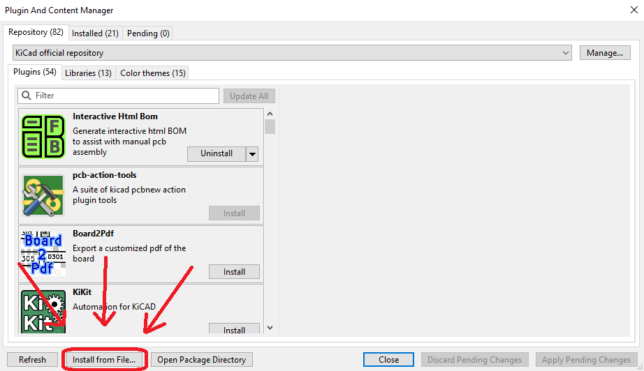

# KiCad NetUpdate

This is a KiCad plugin adapted from [Derg Labs](https://github.com/DergLabs), which allows the user to quickly copy over the NetClass colors from the Schematic view to the PCB view with a single button.

## Usage

1. Create a schematic as usual with colored net classes
2. Open the PCB view
3. Either click the `NetUpdate` button in the toolbar or go to `Tools` -> `External Plugins` -> `NetUpdate`
4. If run successfully, you should save the file and close KiCad
5. Close KiCad completely, including the project manager!
6. Reopen KiCad and the colors should be updated

## Installation

1. Download the [latest version](https://github.com/Cuprum77/kicad-netupdate/releases)
2. Open KiCad Plugin and Content Manager
3. Click on `Install from File...` and select the zip file

